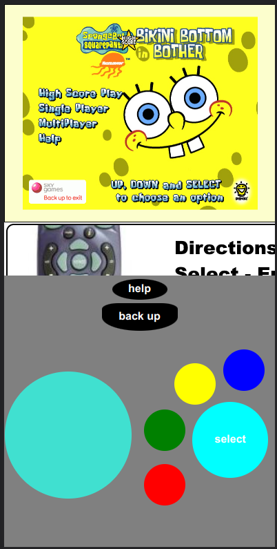

# STB Gaming Userscripts
Userscripts to make Denki's online Sky Games ports more accessible to a range of devices

---

## Installation

### PC
1. Install [Tampermonkey](https://www.tampermonkey.net/)
2. Click the link to the userscript you want to install
3. Tampermonkey should open a new tab with the userscript. Click _Install_ and confirm
### Android
1. Install [Firefox](https://play.google.com/store/apps/details?id=org.mozilla.firefox)
2. Click the hamburger button in the bottom-right corner, go to _Settings_ > _About_ > _About Firefox_ and enable the debug menu by tapping the logo five times.
3. Go back to the settings menu. You should see a new _Advanced_ category, click on _Add-ons_, find Tampermonkey and add it to your browser
4. From this page, click the link to the raw userscript you want to install.
5. Tampermonkey should open a new tab in the browser. Scroll down and click _Install_ and confirm.
### iOS
> TBA
### FireTV
> TBA (possibly same as Android, however Firefox should be installed from an APK as it is no longer supported on FireTV)

## Controller Support
> [gamepad-support.user.js](https://github.com/STB-Gaming/userscripts/raw/master/gamepad-support.user.js)

A userscript that adds controller support to Denki's online Sky Games ports, using the Javascript Gamepad API.

### Button Mappings

Below are the default controls for the Xbox 360 controller, translated to Sky remote buttons

* A: Select
* B: Red
* X: Blue
* Y: Yellow
* Select: Green
* Start: Back Up
* Right Stick: Help

## Mobile Gamepad
> [sky-remote-mobile.user.js](https://github.com/STB-Gaming/userscripts/raw/master/sky-remote-mobile.user.js)

A userscript that adds a virtual Sky Gamepad button layout to mobile browsers, with touch support for mobile devices


## Sky Remote
> [sky-remote.user.js](https://github.com/STB-Gaming/userscripts/raw/master/sky-remote.user.js)

A userscript that adds functions to press Sky remote buttons


### Usage
how to include it in other use scripts
```
// @require https://github.com/STB-Gaming/userscripts/raw/master/sky-remote.user.js
```

### SkyRemote.listButtons()
lists the names of the buttons on the sky remote

### SkyRemote.pressButton(buttonName)
Presses and releases a button

### SkyRemote.holdButton(buttonName)
Presses and holds a button

### SkyRemote.releaseButton(buttonName)
Releases a pressed button.
